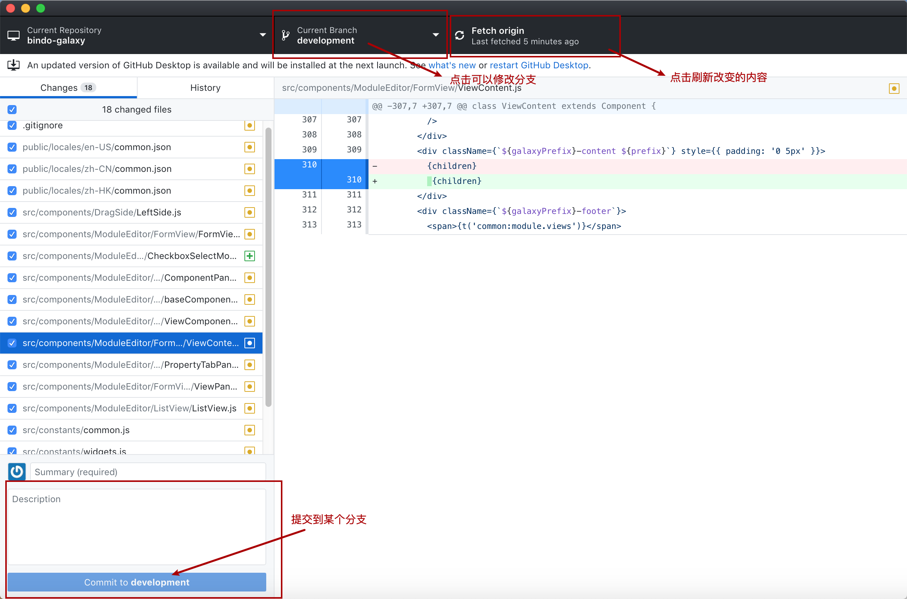
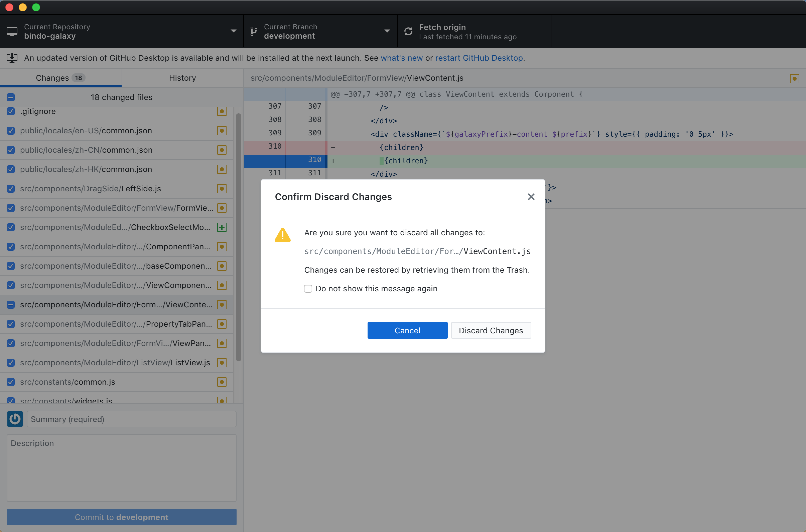

 Discard  changs   丢弃至改变

 lgnore file  add to  ..gitignore   添加到git忽略文件中

 lgnore all .js  add to  ..gitignore   把所有的js添加到git忽略文件中

copy file path  复制文件路劲

reveal in  finder   在finder中查找，就是在本电脑打开

open in vs 在vs 编辑器打开

open with default  program 在默认的编辑器打开

下面窗口 commite  to 到 devlopment 分支

您确定要丢弃所有更改吗
更改可以通过从垃圾中检索它们来恢复
别再显示提示了

  cancel 取消

 discard changes 丢弃改变

